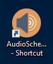

## CWOC Audio Scheduler Instructions

### Logging in to the Laptop

At all times, the laptop should already by logged in and unlocked with the screen on.

If it is not, you will probably first need to press Ctrl+Alt+Del.

If it asks for a username, use `.\CWOCSoundSys`.

The password for this account is `!QAZ@WSX3edc4rfv`.

### Opening the Program

The program window should already be opened.

If it is not, double click the orange sound icon in the task bar on the bottom right:

If the task bar icon is not there, double click on the desktop shortcut:

### Playing a Sound

To play one of the more common sounds, including Reveille, To the Colors, Retreat, National Anthem, and TAPS, click the applicable button on the main window.

To play any other sound, select it in the dropdown under `Select a sound:` and then click `Play`.

To stop the currently playing sound, click `Stop Playing`.

Playing another sound while another is already playing will automatically stop the old one and play the new one.

### Scheduling Sounds

Note that the program considers the next day to start at 0200. For example, if TAPS is scheduled for Saturday in the program, it will play on Sunday morning.

The main window will show the schedule for the current day on the left.

Click the `Edit Schedule` button on the top right to start changing the schedule.

Today's schedule opens by default.

Double click on the sound or time to change it.

Double click on the empty row at the bottom to add a new event.

With an event highlighted, press the Delete key to remove it.

Click the `Import` button to copy events from a template.

Click the `Clear` button to remove all events.

Change the day to edit the schedule for by clicking the dates on the calendar on the left.

Changes are automatically saved - close the window when you're done.

### Volume

The volume for Windows should be kept at 65% for most cases.